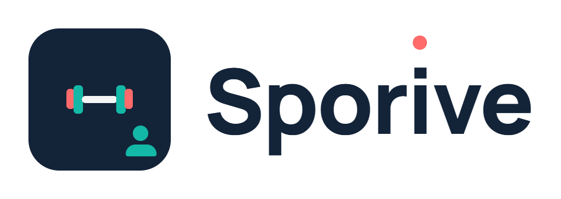

AIによるパーソナライズされたトレーニング計画を提案するフィットネスPWA。

- 要件定義書: [docs/requirements.md](docs/requirements.md)
- 開発プラン: [docs/development-plan.md](docs/development-plan.md)

## 技術スタック

- Next.js 16（App Router / TypeScript）+ Tailwind CSS v4
- Supabase（PostgreSQL + Auth）
- Google Gemini API
- Web Push（VAPID）+ GitHub Actions scheduled workflow
- ホスティング: Vercel

## 開発

```bash
npm install
cp .env.local.example .env.local   # Supabase等の値を設定（docs/setup-phase1.md 参照）
npm run dev    # http://localhost:3000
```

Phase 1（認証）の動作にはSupabase / Google Cloud のセットアップが必要です。手順は
[docs/setup-phase1.md](docs/setup-phase1.md) を参照してください。

利用者画面はスマホ専用のため、ブラウザの開発者ツールでデバイスエミュレーション（スマホUA）を有効にして確認してください。

```bash
npm run lint       # ESLint
npx tsc --noEmit   # 型チェック
npm run build      # 本番ビルド
```
